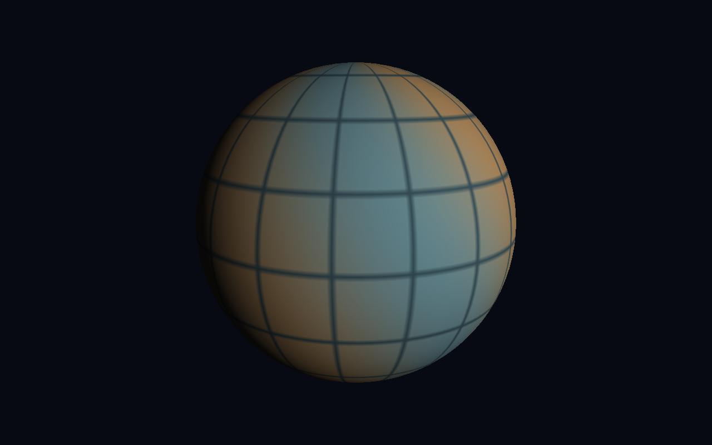

# PlanetSimulator

Een C# / MonoGame-project dat iteratief groeit naar een wetenschappelijk onderbouwde terraforming-simulator met een overtuigende 3D-planeet.

## Milestone 1

Een eenvoudige belichte 3D-bol, orbitcamera, wireframe en een onafhankelijke simulatieklok. De strepen en het rooster zijn decoratief en maken rotatie zichtbaar. Er is nog geen klimaat, echte topografie, oceaan of atmosfeer. De planeet gebruikt aardachtige massa, straal en een expliciete rotatieperiode van 24 uur; dit is een fictief referentiescenario.

## Starten

Installeer de .NET 10 SDK op Windows en voer vanuit deze map uit:

```powershell
dotnet restore PlanetSimulator.slnx
dotnet build PlanetSimulator.slnx
dotnet test PlanetSimulator.slnx
dotnet run --project src/PlanetSimulator.Desktop
```

Open PlanetSimulator.slnx eventueel in een IDE die .NET 10 en slnx ondersteunt. Geen betaalde engine, afbeeldingen, fonts of content-build-tools nodig. DesktopGL heeft een grafische desktop en werkende OpenGL-driver nodig; Windows is het eerste testdoel.

## Bediening

| Actie | Bediening |
|---|---|
| Camera draaien | Linkermuisknop slepen |
| Zoomen | Muiswiel |
| Pauze | Spatie |
| 1 seconde per echte seconde | 1 |
| 1 uur per echte seconde | 2 (standaard) |
| 1 dag per echte seconde | 3 |
| Wireframe | W |
| Tijd en camera resetten | R |
| Afsluiten | Escape |

Tijd, snelheid en pauzestatus staan in de venstertitel. Op 1x blijft de simulatieklok in stappen van één minuut werken; dit is bewust. Camerabediening blijft tijdens pauze beschikbaar.

## Architectuur

- Simulation: uitsluitend double-precisie, SI-eenheden en vaste stappen; geen MonoGame-afhankelijkheid.
- Desktop: presentatie, procedurele sphere-mesh en input. Een renderunit is de planeetstraal, geen meter.
- Tests: klokgedrag, partitionering, pauze, reset, validatie, cancellation en rotatie.

De klok is nog geen integrator: milestone 2 moet iedere vaste stap aan de modelberekeningen doorgeven. Visuele verlichting is nu een illustratie en berekent geen warmtestroom. De mesh gebruikt voorlopig geen face-culling; optimalisatie volgt later.

## Validatie en publicatie

GitHub Actions bouwt en test op Windows en maakt een zelfstandig Windows-downloadpakket. Zie docs/VALIDATION.md voor de werkelijke lokale validatiestatus. De broncode staat in de private repository https://github.com/pjotrcasteel/PlanetSimulator.

Zie [de roadmap](docs/ROADMAP.md) voor de volledige ontwikkelroute.


